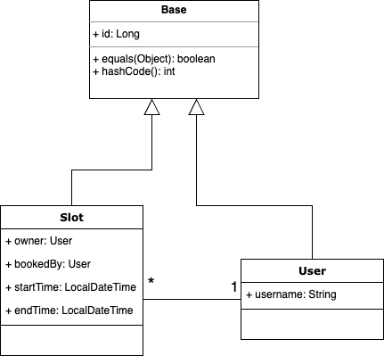

## Please type your answers or explanations below.
#### A - The entities

Designed this basic appointment system with 2 main classes: Slot and User.

Created Base class which the other entity classes are extended from.

#### B - Manage The Data

Changed properties file to yaml.
Flyway queries added. 
Repository and Service classes added.

#### C - Expose data with a RESTful API

Controllers added. (Used RequestParams to ease of use with Postman.)\
Check for conflicts when creating new slot.\
Check for trying to book user's own slot.\
Exception types created.

Exception messages are written directly to response instead of JSON as it shows the message clear on Postman. 

Importable postman collection added to main directory.

#### D - Scheduled Task

Added scheduled task for every minute. This task gets booked slots that will start at 15 minutes from now and simply writes a log about it.

#### E - Improvements
